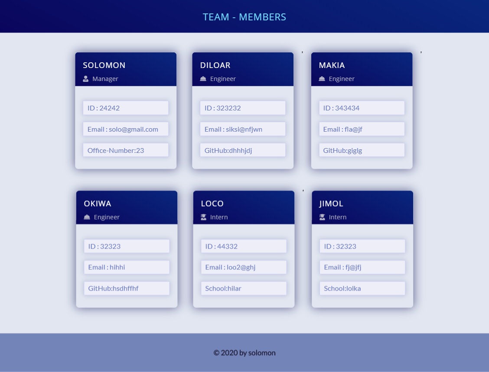
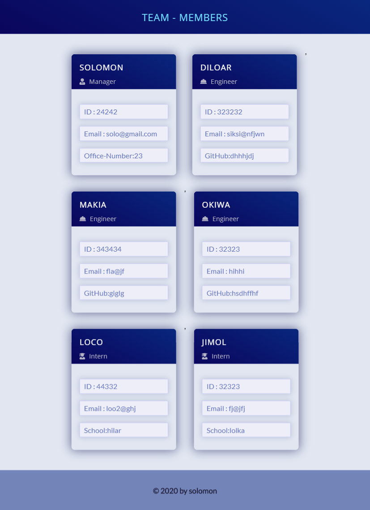
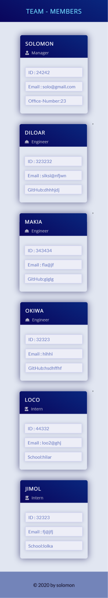

# Employee - Profile generator


## Description

Its node application that helps campanies to generate team -members profile that includes thir name, id,job title,email and depending on their role it provides information about github username,office number and school name if they are in internship program.

## Table of Contents

- [Installation](#installation)
- [Usage](#usage)
- [Credits](#credits)
- [License](#license)
- [Visuals](#visuals)

## Installation

Download or clone the repo to your local machine and install the dependencies by running 'npm install' in the terminal.After that run the app from your code editor terminal since it is a node application run 'node index.js', answer all the questions as needed.

## Usage

As it is node application install all the npm dependencies required before runing the app

## License


## Contribution

Fork it to your github repos ,then you can make any changes with out affecting the main source code

[My Github Profile](https://github.com/solomonmeresa)

## How to reach me

Email : solomonmeresa8@gmail.com

## Test

```javascript
👉 npm run test
```

## visuals

It generates responsive app in all screen sizes

### Large-screen



### Medium-screen



### Small-screen



Made by solomon

### ©️2020 Employee-profile generator
